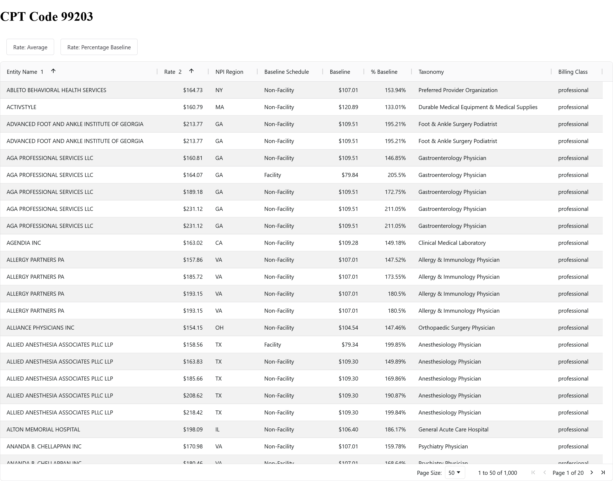
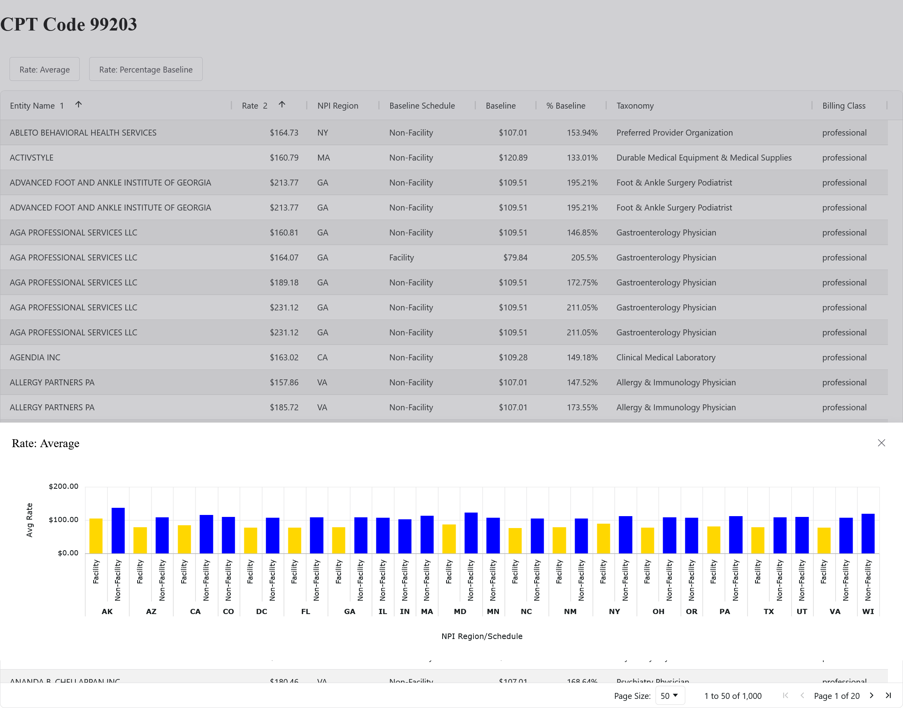
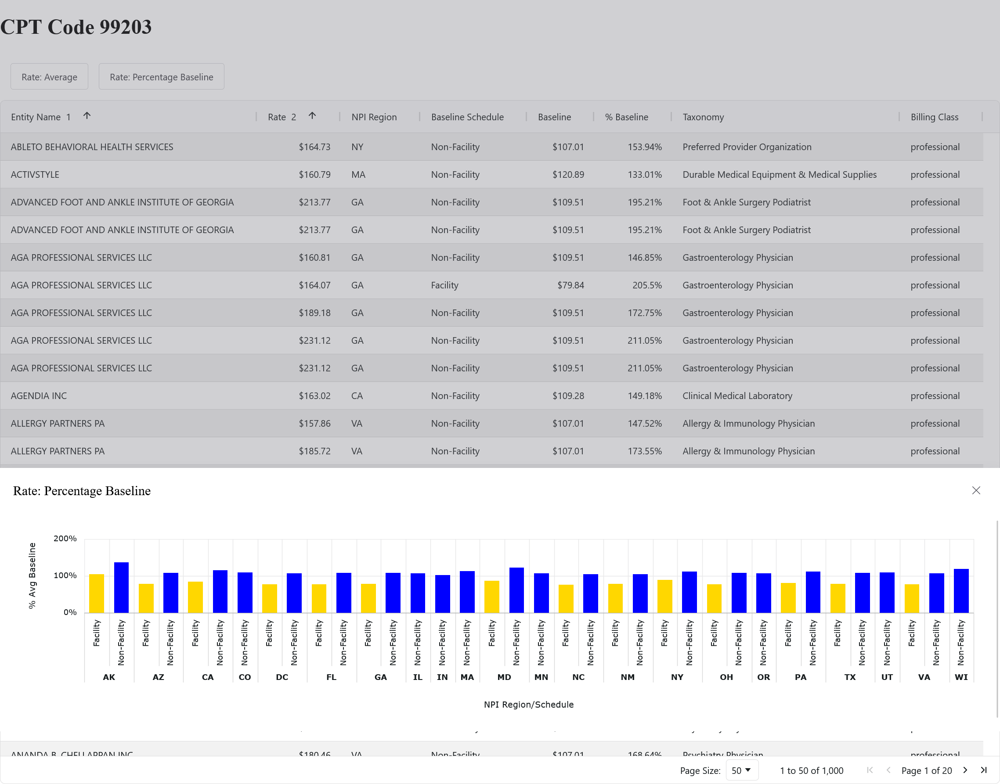

# neuron
coding exercise

## Approach

A reactive library like Vue or React seemed overkill for this project. I've been reading about framework-agnostic web 
component ("custom element") libraries like [Shoelace](https://shoelace.style) (soon to be [Web Awesome](https://webawesome.com/))
and wanted to give it a try*. However, neither currently offers data grid or chart components. I found [AG Grid and 
AG Charts](https://www.ag-grid.com/) to fill that need, again framework-agnostically. Had I used Vue, I probably 
would've included Quasar, with which I am very familiar.

Otherwise, I used native Web APIs and vanilla CSS. I've also read about and attempted to use
["class-less" CSS](https://www.spicyweb.dev/css-nouveau/1-vanilla-has-never-tasted-so-hot/5-class-less-css-ftw!/)*, 
though that's reflected less in what little styling I applied and more in my `querySelector`s.

Finally, I wanted to use TypeScript, so I quickly added 
Vite for some transpiling, dev server HMR functionality and environment variables (to keep the API KEY out of 
version control). All told, this is a project with very few module dependencies.

I spent a lot of my time just trying to figure out how to use the data. I'd throw fields into the table and sort by 
that column to see if there were any variance and, if so, how it affected other values. There is probably additional
variance in fields I didn't use, but I didn't want to clutter the table too much or demand too much screen width. I 
did add a "details" dialog, available by clicking on the "Entity Name" to provide more information as requested.

_*Of course, I'm happy to use whatever. It's not often I have an actual project to use for trying new things and 
wanted to take full advantage._ 

## Demo

To see the result
 - clone the repo
 - install packages
 - add your API KEY to [`src/NeuronAPI.ts`](src/NeuronAPI.ts)'s `constructor`
 - `run dev` with your package manager

I developed in Firefox and tested in Chrome.

### Screens

## Known issues and unfinished work

I couldn't get `<sl-icon>` to work. I'm sure it's just a matter of making the SVG assets available to the DOM, but 
that turned out to be trickier than I wanted to devote time to fixing. Had it worked, I would've added chart icons to 
the two buttons that toggle the chart drawers.

I started down the path of grouping the data by `npi_region` and `baseline_schedule`, leading to the layered x-axis 
displayed in the charts. I realized that was not only unnecessary, but too visually complex. However, backing that 
out was going to take some work--not only in restructuring the data but also in reconfiguring the charts. 

I think the charts might be better served in a nearly-full screen dialog, rather than a bottom drawer.

In the table and charts, I threw away the actual `baseline_schedule` value in favor of simplifying, but maybe that's
important `¯\_(ツ)_/¯`. I also discarded `null` values on the charts to simplify.

There is code duplication in the two `Chart` sub-subclasses, specifically the `data.forEach` loop, that could be 
pushed to the middle `ChartRates` class. Centralizing the data parsing, and doing it once, would also improve 
performance.

## Future development

Given the state-based nature of the charts, I would love to have displayed the data on a
[geographic chart](https://www.ag-grid.com/charts/javascript/map-shapes/), but that is locked behind AG Charts' 
Enterprise paywall.

I'm sure this project could use better error handling and messaging. No information is provided to the user if the API 
call fails.

There are plenty of opportunities for "drilling down". I intended the details dialog as a prototype for that. I 
could've, for example, put the "Baseline Schedule" and "Baseline" in a dialog for the "% Baseline" cell. It all 
depends on what data the user needs to have for sorting and what is "secondary".

The table isn't designed for smaller screens, though it should scroll horizontally. It probably could be done, but that 
initiative would depend on knowing the audience and its use cases. 

The table could use some search/filter functionality.
